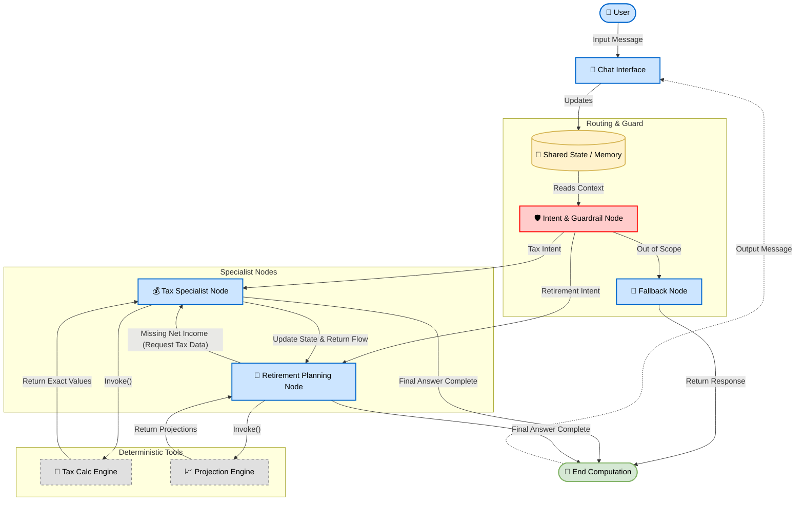

# 🤖 Personal Finance AI Agent (Thai Tax & Retirement)

A conversational AI agent built with **LangGraph** and **Google Gemini (gemini-3-flash-preview)** to help users with Thai personal income tax calculations and retirement planning. The system features a multi-agent architecture with strict intent routing and stateful memory.

## ✨ Features

* **🛡️ Guardrail Routing:** Automatically classifies user intent to ensure the bot stays on topic (Tax or Retirement) and handles out-of-scope questions gracefully.
* **💰 Thai Tax Calculator:** Uses a deterministic tool to accurately calculate Thai progressive personal income tax, including basic deductions.
* **👴 Retirement Planning:** Provides personalized retirement advice based on the user's calculated net income.
* **🤝 Agent Collaboration:** Agents can pass data between each other. If the Retirement agent detects a change in the user's income, it automatically routes the context back to the Tax agent for recalculation.
* **🧠 Stateful Memory:** Remembers the user's financial profile (income, tax, net income) throughout the conversation.

## 🛠️ Prerequisites

Before you begin, ensure you have the following installed:
* Python 3.9 or higher
* A valid Google Gemini API Key

## 📦 Installation

1.  **Clone the repository** (if applicable):
    ```bash
    git clone [https://github.com/yourusername/finance-ai-agent.git](https://github.com/yourusername/finance-ai-agent.git)
    cd finance-ai-agent
    ```

2.  **Install the required dependencies:**
    Make sure to install the following Python packages:
    ```bash
    pip install langchain-core langchain-google-genai langgraph pydantic httpx
    ```

3.  **Set your API Key:**
    Export your Google Gemini API key as an environment variable in your terminal:
    ```bash
    export GOOGLE_API_KEY="your_api_key_here"
    ```

## 🚀 Usage

Run the main Python script to start the interactive terminal chat:

```bash
python main.py
```

## Example Interaction

🤖 Personal Finance Chat AI Initialized!
Type 'exit' or 'quit' to end the conversation.


👤 You: สวัสดีครับ ปีนี้ผมมีรายได้ 1,200,000 บาท ต้องเสียภาษีเท่าไหร่?

🤖 AI:
[Tax Agent provides calculation based on Thai tax brackets]

👤 You: แล้วถ้าผมอยากวางแผนเกษียณด้วยเงินก้อนนี้ล่ะ?

🤖 AI:
[Retirement Agent uses the 'net_income' from the previous step to give advice]

## 🧠 System Architecture (LangGraph)
The workflow consists of four main nodes:

guardrail_node (Entry Point): Analyzes the prompt and dictates the route (tax, retirement, or out_of_scope).

tax_agent_node: Extracts income, calculates taxes using deterministic Python logic, and updates the user profile.

retirement_agent_node: Gives advice based on net income. Triggers the tax agent if it detects new income figures in the chat.

fallback_node: Politely declines requests that fall outside the financial scope.

## ⚠️ Important Notes for Development
SSL Bypass: This code currently contains an httpx.Client hack to bypass SSL verification (verify=False). This is specifically configured for internal workshop environments. Please remove or comment out this section before deploying to a production environment.

Language: The underlying system prompts and AI responses are configured in Thai to best serve the target demographic.

## Multi-Agent System (Diagram)

